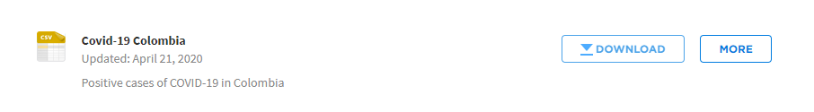
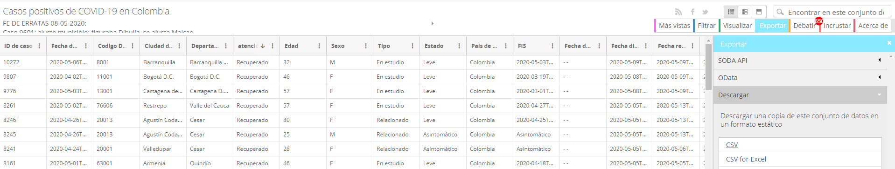
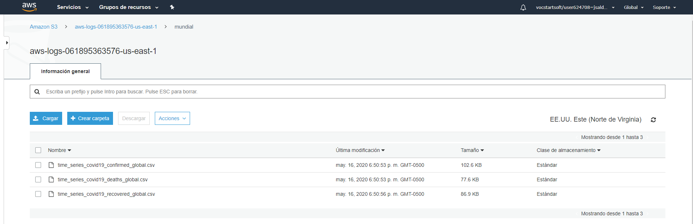
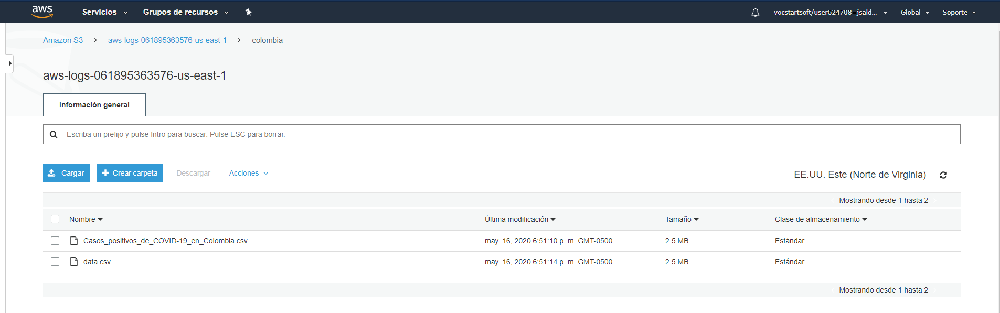
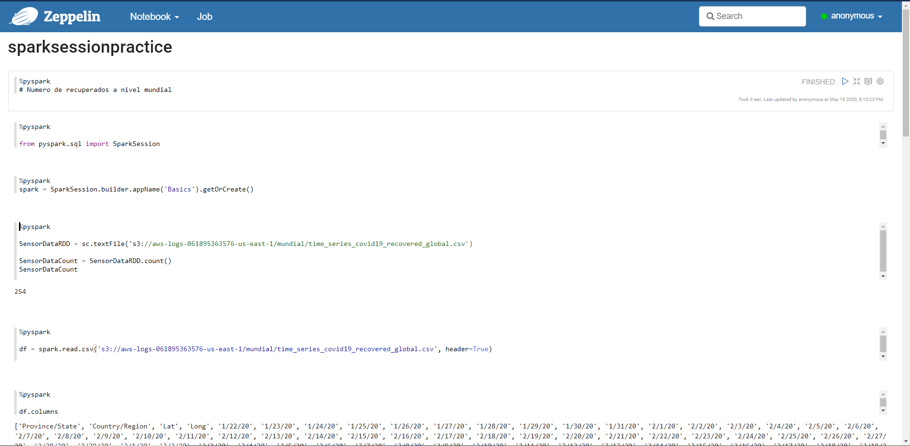
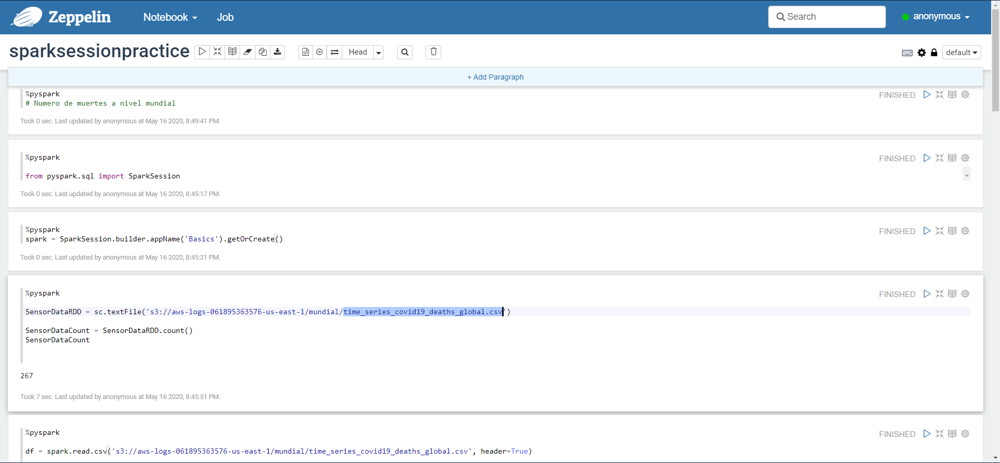
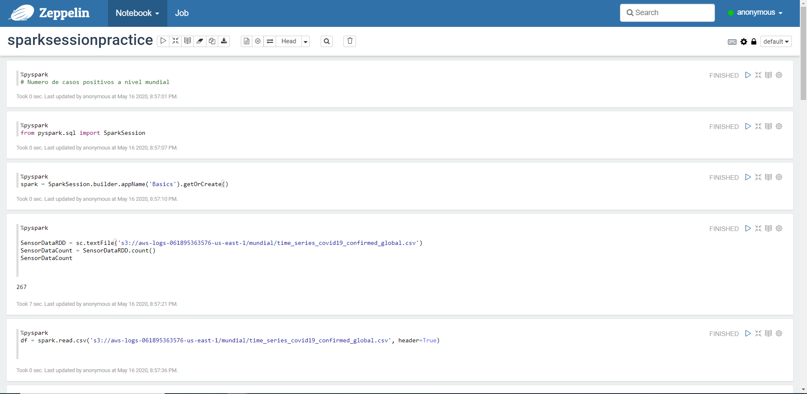
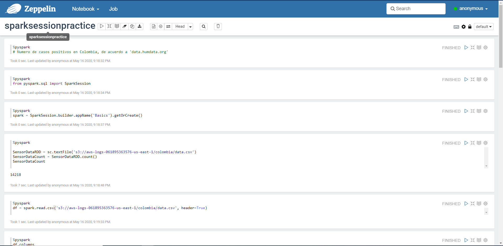

# Universidad EAFIT
# Curso ST0263 Tópicos Especiales en Telemática, 2020-1
# Estudiante: Juan Diego Saldarriaga - jsalda23@eafit.edu.co
# Trabajo 3 - SPARK sobre COVID19
### Trabajo individual
# Realizar análisis exploratorio de datos sobre datasets de COVID-19:

## 1. Fuentes de datos
 ### Se realizó la descarga de los siguientes datasets:
  #### A nivel mundial:
   ##### https://data.humdata.org/dataset/novel-coronavirus-2019-ncov-cases
   

  #### A nivel colombia:
   ##### https://data.humdata.org/dataset/positive-cases-of-covid-19-in-colombia
   

   ##### https://www.ins.gov.co/Paginas/Inicio.aspx
   

## 2. Ingesta y almacenamiento de datos
  ### Construcción del datalake en AWS con S3 y carga de datos
  
  
  

## 3. Procesamiento: Análisis exploratorio de datos con pyspark

 ### Casos recuperados a nivel Mundial
  #### En la siguiente imagen se puede evidenciar la primera parte del análisis exploratorio de los casos recuperados a nivel Mundial. El analisis completo se encuentra adjunto en la carpeta "RecuperadosMundialmente"
  

 ### Muertes a nivel Mundial
  #### En la siguiente imagen se puede evidenciar la primera parte del análisis exploratorio de las muertes a nivel Mundial. El analisis completo se encuentra adjunto en la carpeta "MuertesMundialmente"
 
 
 ### Casos confirmados a nivel Mundial
  #### En la siguiente imagen se puede evidenciar la primera parte del análisis exploratorio de los casos confirmados a nivel Mundial. El analisis completo se encuentra adjunto en la carpeta "CasosMundialmente"
 
 
### Casos confirmados en Colombia de acuerdo a 'INS.gov.co'
  #### En la siguiente imagen se puede evidenciar la primera parte del análisis exploratorio de los casos confirmados en colombia de acuerdo a 'INS.gov.co'. El analisis completo se encuentra adjunto en la carpeta "CasosPositivosColombia_INS"
 

### Casos confirmados en Colombia de acuerdo a 'data.humdata.org'
  #### En la siguiente imagen se puede evidenciar la primera parte del análisis exploratorio de los casos confirmados en Colombia de acuerdo a 'data.humdata.org'. El analisis completo se encuentra adjunto en la carpeta "CasosPositivosColombia_humdata"
 
 

## 4. Visualización básica de datos (Kibana)

### 4.1. Situación en el mundo
### 4.2. Situación en Colombia
### 4.3. Colombia vs el mundo
 
 

