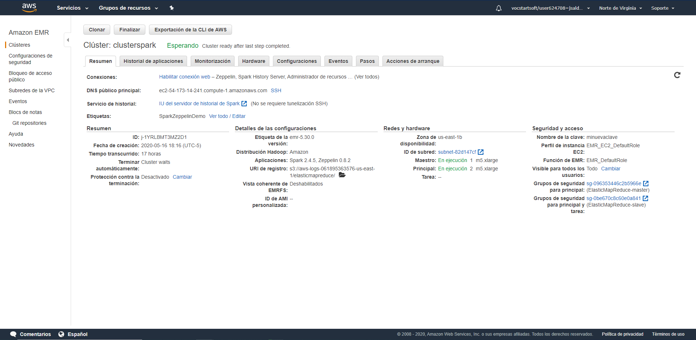
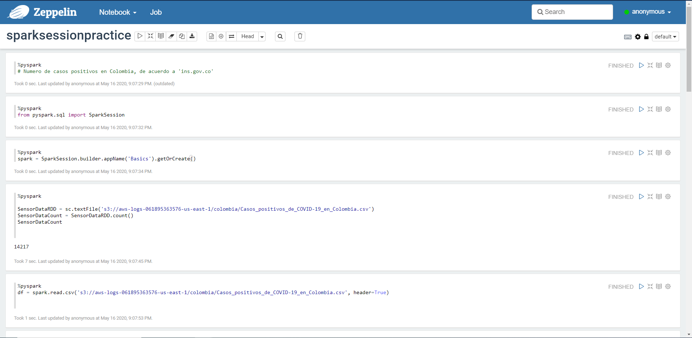
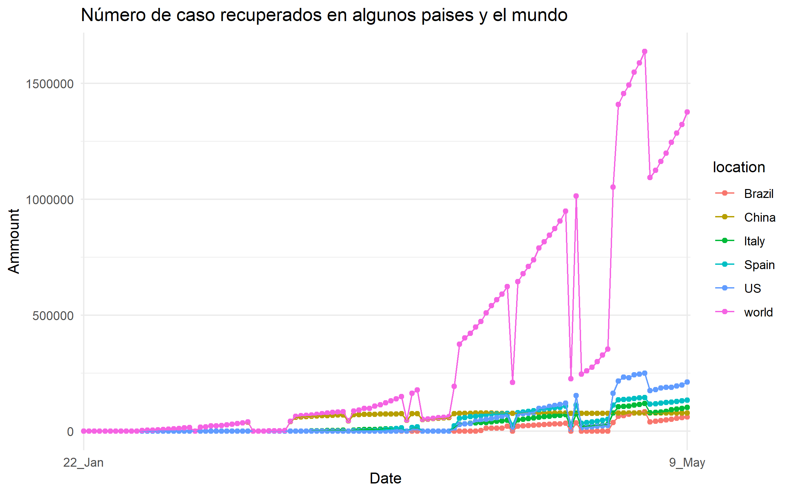
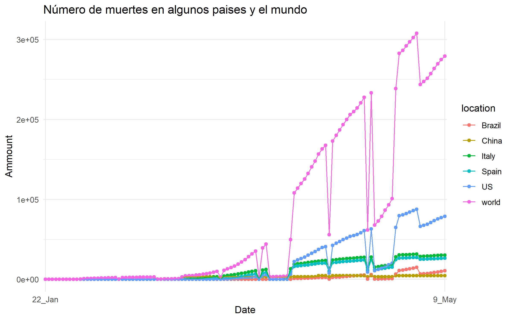
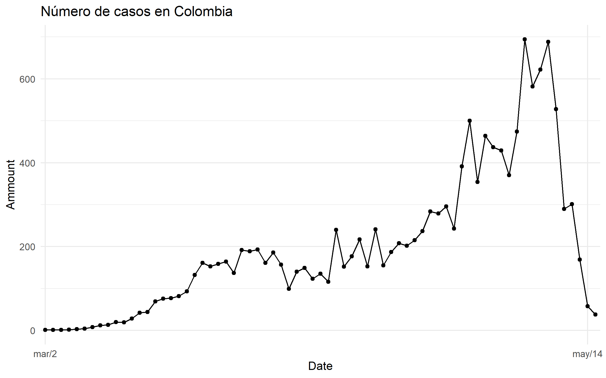
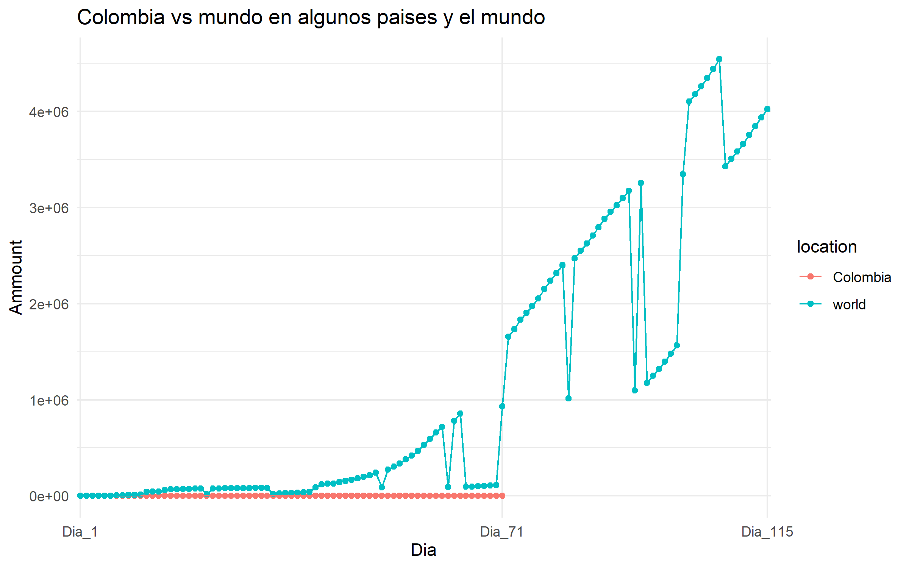
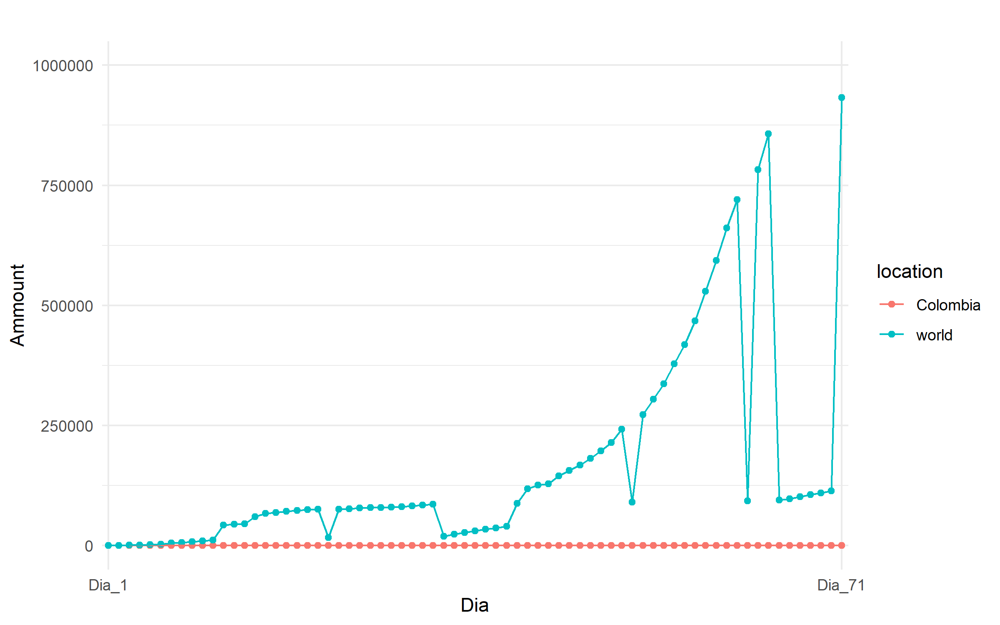

# Universidad EAFIT
# Curso ST0263 Tópicos Especiales en Telemática, 2020-1
# Estudiante: Juan Diego Saldarriaga - jsalda23@eafit.edu.co
# Trabajo 3 - SPARK sobre COVID19
### Trabajo individual
# Realizar análisis exploratorio de datos sobre datasets de COVID-19:

## 1. Fuentes de datos
 ### Se realizó la descarga de los siguientes datasets:
  #### A nivel mundial:
   ##### https://data.humdata.org/dataset/novel-coronavirus-2019-ncov-cases
   

  #### A nivel colombia:
   ##### https://data.humdata.org/dataset/positive-cases-of-covid-19-in-colombia
   

   ##### https://www.ins.gov.co/Paginas/Inicio.aspx
   

## 2. Ingesta y almacenamiento de datos
  ### Construcción del datalake en AWS con S3 y carga de datos
  
  
  

## 3. Procesamiento: Análisis exploratorio de datos con pyspark

 ### Creación EMR en AWS
  #### Creamos un EMR en AWS en el cual usaremos el notebook Zeppelin para la exploración de los datos
 

 ### Casos recuperados a nivel Mundial
  #### En la siguiente imagen se puede evidenciar la primera parte del análisis exploratorio de los casos recuperados a nivel Mundial. El analisis completo se encuentra adjunto en la carpeta "RecuperadosMundialmente"
  

 ### Muertes a nivel Mundial
  #### En la siguiente imagen se puede evidenciar la primera parte del análisis exploratorio de las muertes a nivel Mundial. El analisis completo se encuentra adjunto en la carpeta "MuertesMundialmente"
 
 
 ### Casos confirmados a nivel Mundial
  #### En la siguiente imagen se puede evidenciar la primera parte del análisis exploratorio de los casos confirmados a nivel Mundial. El analisis completo se encuentra adjunto en la carpeta "CasosMundialmente"
 
 
### Casos confirmados en Colombia de acuerdo a 'INS.gov.co'
  #### En la siguiente imagen se puede evidenciar la primera parte del análisis exploratorio de los casos confirmados en colombia de acuerdo a 'INS.gov.co'. El analisis completo se encuentra adjunto en la carpeta "CasosPositivosColombia_INS"
 

### Casos confirmados en Colombia de acuerdo a 'data.humdata.org'
  #### En la siguiente imagen se puede evidenciar la primera parte del análisis exploratorio de los casos confirmados en Colombia de acuerdo a 'data.humdata.org'. El analisis completo se encuentra adjunto en la carpeta "CasosPositivosColombia_humdata"
 
 

## 4. Visualización básica de datos (Usando R)
 ### Para la manipulación y visualicación de los datos usamos R. Para realizar esta visualización fue necesario tener fechas como factores y organizar los datos por paises, arupando por pais y fecha, y relizando las sumas de lo datos.Posteriormente fue necesario verificar la estructura interna de las nuevas tablas y de los datos de colombia.
 ### Cabe aclarar, que para la facilidad de la visualización, de la situación Mundial, se seleccionaron algunos paises de interes, y el total mundial de los registros. El Script con mayor detalle de como se realizó este analisis y posterior visualización se encuentra en la carpeta "Visualización-R".

 ### 4.1. Situación en el mundo 
  #### Casos confirmados
  
  
  #### Casos Recuperados
  
  
  #### Total de muertes
  
  
 ### 4.2. Situación en Colombia
  #### Los registros en Colombia inician el 26 de febrero de 2020, el día del primer caso positivo en el país. 
  
  
 ### 4.3. Colombia vs el mundo
  #### Aunque los registros a nivel mundial inician antes de los registros en Colombia, para poder realizar la comparación es necesario que ambos estén en la misma linea de tiempo. Sin embargo, al Colombia tener, considerablemente pocos casos no es muy visible su comparación con los registros a nivel mundial.
  
  
 
 

